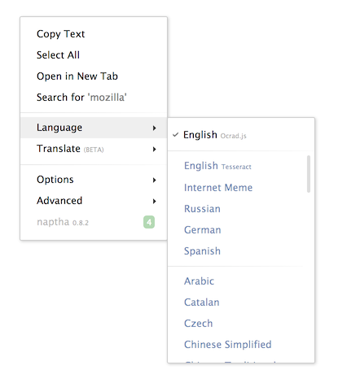

menu
====

Making a good hierarchical menu is actually quite difficult. The naïve approach tends to leave a lot to be desired, because you end up with a menu which disappears under your cursor, or forces the user to mouse around in weird [L tetromino](http://en.wikipedia.org/wiki/Tetromino) paths, rather than the intuitive straight-line trajectory. 

[Ben Kamens](http://bjk5.com/post/44698559168/breaking-down-amazons-mega-dropdown) has a great writeup about a version of the solution, first invented by Bruce Tognazzini in the late 80's. 

In addition to being above-average usable with a mouse, it's also pretty neat with a keyboard as well, supporting navigation by arrow keys and a TextMate-file-finder-style interface for selecting menu items (actually, it doesn't flatten out the menu items, which would be a neat feature to add). 

It inherits default styling from Google Chrome's WebUI, which looks fittingly out-of-place on all platforms (also it's flat, just as the buzzword zeitgeist of late 2013 would prescribe).  

So this is just a little javascript context menu script which takes that to heart. Coupled with [solitude](https://github.com/naptha/solitude), my horribly nasty approach to CSS isolation, this can be used to inject context menus as content scripts onto web pages running potentially evil CSS. 

### but wait

so the great strength of this context menu script is that it probably pays more attention to user experience than anything else out there at the moment. this does run with a rather substantial caveat.

there's a widespread misconception that ancient cartographic maps had undiscovered regions of the oceans marked with "HIC SUNT DRACONES", or "HERE BE DRAGONS". there isn't really any evidence that this was ever done in any map from the time period.

and back then, there were tons of things that were pretty terrifying- ship wrecks, being stranded at sea with no ability to discern longitude, scurvy and more. but those wise cartographers deemed none of these to be so truly horrific to bear a warning of dragons, to spare that label for when the time came that something would truly be worthy of that warning: my code. 

### what is it gonna look like

